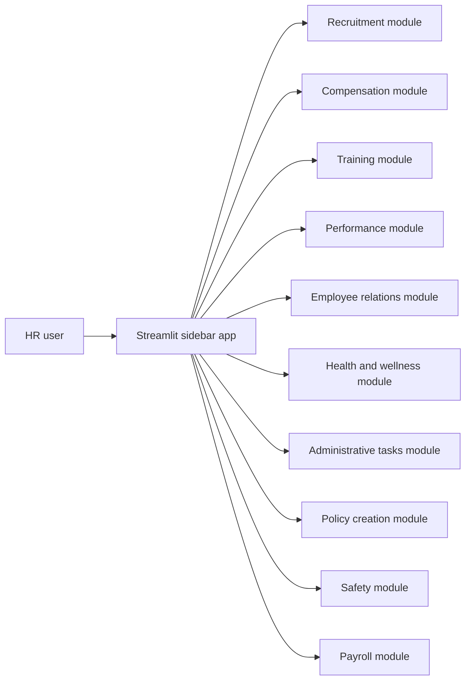

# HR_AI_Assistant

## Problem
This project is aimed at reducing the manual overhead of common HR workflows by giving HR teams one interface for routine functions like recruitment, compensation calculation, training assignment, performance tracking, policy drafting, safety reporting, and payroll entry.

## System Design

- Architecture:
  - the application logic is implemented in [`final.py`](C:\Users\91965\cars24\github-readme-batch\HR_AI_Assistant\final.py)
  - Streamlit renders a sidebar menu and switches between HR function pages
  - each HR module gathers form input and returns a basic success response
- Components:
  - UI: Streamlit
  - state: user inputs handled inside each module flow
  - AI: planned but not yet implemented in the checked-in code
- There is no LLM integration, vector DB, persistent database, or API backend in the current repository state.

## Approach
- Why multi-agent?
  - Multi-agent is not implemented in the current code. The repo uses a single Streamlit app with separate functional modules.
- Why RAG?
  - RAG is not used. The app currently behaves like a structured HR dashboard and form workflow rather than a knowledge-grounded assistant.
- What the code actually does:
  - shows HR function categories in a sidebar
  - accepts simple user inputs for each category
  - performs lightweight calculations such as salary plus bonus
  - confirms actions like assigning training, reporting safety issues, or generating payroll

## Tech Stack
- Python
- Streamlit

## Demo
- Run the app with Streamlit
- Choose a module such as Recruitment, Payroll, or Policy Creation
- Enter the requested values
- Submit the form and review the confirmation output

## Results
- The repo delivers a navigable HR operations prototype rather than a full AI system.
- The current value is UI consolidation:
  - one app shell for multiple HR workflows
  - low-friction data entry for common HR tasks
  - a base structure that could later host real AI modules

## Learnings
- What worked:
  - Streamlit is a good fit for quickly prototyping business workflow dashboards
  - the module-based structure makes it easy to expand one HR domain at a time
  - the app already covers a broad range of HR categories in one place
- What did not:
  - the "AI assistant" framing is ahead of the implementation; most modules are currently form stubs with placeholder behavior
  - the repo includes two README files with overlapping but inconsistent descriptions
  - the usage docs previously referenced `app.py`, while the checked-in executable is [`final.py`](C:\Users\91965\cars24\github-readme-batch\HR_AI_Assistant\final.py)

## Supporting Docs
- [Architecture diagram](docs/architecture.png)
- [Demo preview](docs/demo_preview.png)
- [Evaluation logs and outputs](docs/evaluation.md)
- [Sample inputs and outputs](docs/sample_io.md)
- [Rich example assets](docs/examples/)
- [Representative outputs](docs/outputs/)
